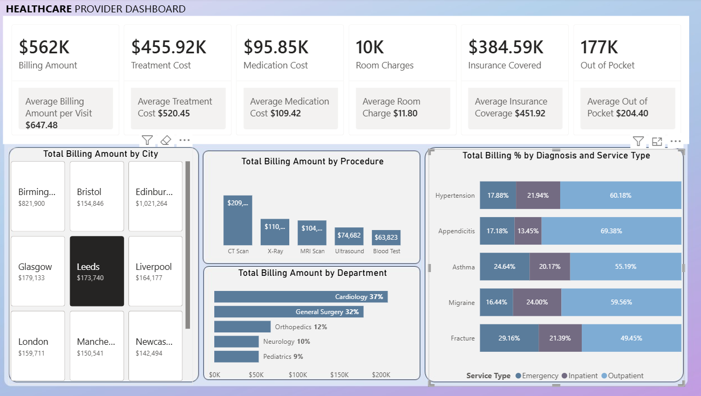

# Healthcare Provider Analysis

Developed an interactive Power BI dashboard to analyze healthcare provider billing, treatment costs, medication expenses, insurance coverage, and patient out-of-pocket costs. The dashboard provides actionable insights into billing performance by city, procedure, department, diagnosis, and service type, enabling stakeholders to identify cost patterns, compare service utilization, and monitor financial performance.
---
Key Features:

KPI tracking for total billing, treatment, medication, room, insurance, and out-of-pocket costs
Average cost analysis per patient visit
Billing analysis by city, procedure, and department
Diagnosis-level billing distribution across Emergency, Inpatient, and Outpatient services
Interactive filtering and drill-down capabilities
Data visualization using bar charts, stacked percentage charts, and KPI cards

---
Tools: Power BI, DAX, Data Modeling, Data Visualization, Excel/CSV

---
Business Impact:
* Identify high-cost procedures and departments to support cost optimization.
* Compare billing performance across cities and identify underperforming or high-revenue locations.
* Analyze diagnosis and service-type trends across Emergency, Inpatient, and Outpatient care.
* Monitor insurance vs. out-of-pocket costs to understand patient financial burden.
* Track key financial KPIs and quickly identify cost and revenue patterns for data-driven decision-making.

---
Dashboard:

